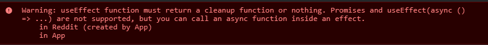

# Theory Assignment- Episode 8

> **How do you create Nested Routes using react-router-dom Configuration?**

```
const appRouter = createBrowserRouter([
  {
    path: "/",
    element: <AppLayout />,
    children: [
      {
        path: "/",
        element: <Body />,
        children: [
            {
                path: "/index",
                element: <Index />,
                children: [
                    {
                        path: '/child'
                        element: <Child />
                    }
                ]
            }
        ]
      },
    ],
    errorElement: <Error />,
  },
]);
```

> **Read about createHashRouter, createMemoryRouter from React Router docs?**

```
- `createHashRouter` is useful if you are unable to configure your web server to direct all traffic to your React Router application. Instead of using normal URLs, it will use the hash (#) portion of the URL to manage the "application URL".

- `createMemoryRouter` Instead of using the browsers history a memory router manages it's own history stack in memory. It's primarily useful for testing and component development tools like Storybook, but can also be used for running React Router in any non-browser environment.
```

> **What is the order of life cycle method calls in Class Based components?**

```
- constructor()
- render ()
- componentDidMount()
- componentDidUpdate()
- componentWillUnmount()
```

> **Why do we use componentDidMount?**

```
This method is called during the Mounting phase of the React Life-cycle i.e after the component is rendered.
This method can be called to either fetch the data from An External API or perform some unique operations which need the JSX elements.
```

> **Why do we use componentWillUnmount? Show with example?**

```
It is called when we are leaving the component. When we go from one component to other component, it is a single page and we are switching components, so we need to clear things up.So, we perform any necessary cleanup in this method, such as invalidating timers, canceling network requests, or cleaning up any subscriptions that were created in componentDidMount().
```

> **Why do we use super(props) in constructor?**

```
- super(props) is used to inherit the properties and access of variables of the React parent class when we initialize our component. super() is used inside constructor of a class to derive all the properties of the parent inside the class that extended it.

- React will throw an error as `Uncaught ReferenceError: Must call super constructor in derived class before accessing 'this' or returning from derived constructor`

- Importantly, you can’t use `this` in a constructor until after you’ve called the parent constructor. JavaScript won’t let you, due to which we will not be able to access anything from the parent component.

```

> **Why can't we have the callback function of useEffect async?**

```

useEffect expects it's callback function to return nothing or return a function (cleanup function that is called when the component is unmounted). If we make the callback function as async, it will return a promise and the promise will affect the clean-up function from being called.
```
