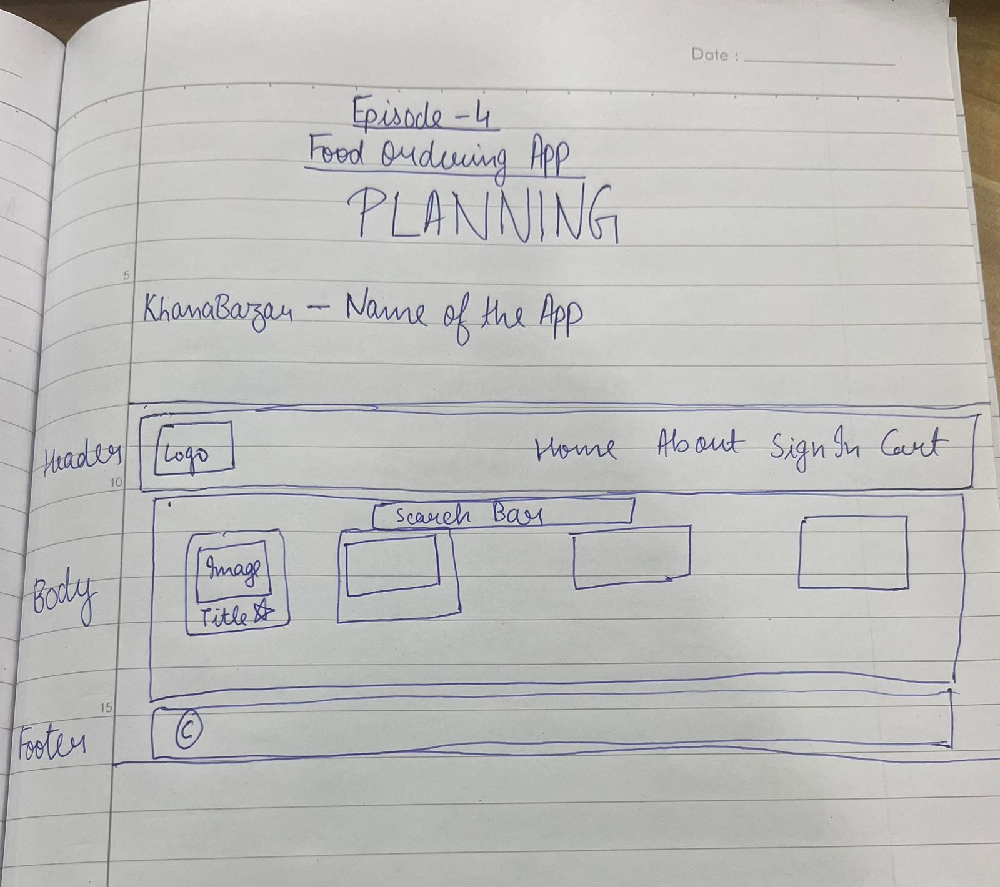

# Episode 4:- Talk is Cheap, show me the code!

We will be building a food ordering app!
Whenever you are asked to build an app, the first thing before building is to plan the app.

-

// App Components

- Header
  - Logo
  - Nav Item
- Body
  - Search Bar
  - Restaurant cards Container
    - Restaurant Card
      - image
      - Name
      - Rating
      - Cuisine
      - Delivery time
- Footer
  - CopyRight
  - Links
  - Address
  - Contact Information

We will use the above as reference and then will build the app based on this

Another Beauty of JSX is we can add css styles in js object as well
example-
```
const styleCard = {
  backgroundColor: "#f0f0f0"
}
and then use styleCard as `style={styleCard}`
```
But we do not prefer to use inline styles.

To make the Restaurant cards dynamic, we can make us of props.
- Props is a short form for properties, it is something that we can pass to the component. <=
- Props are just normal arguments to a function, just the way a component is a function in JS <=
- Passing a prop to a function, is just like passing a few arguments to the function
- Example of passing props to a component

`<RestaurantCard resName="KFC" cuisine="Burger, Fast Food"/>`
Props can be accessed within the component from an object, known as props.

> When you want to dynamically pass in some data to a component, you pass in as a prop.
- You can pass in any number of props you want to, react will pass it in the props object
- We can destructure it on the fly, which means:-
```
`const RestaurantCard = (props) => {console.log(props.resName, props.cuisine)}`
can be written as
 `const RestaurantCard = ({resName, cuisine}) => {console.log(resName, cuisine)}`
```
An industry standard which can be useful in system design interviews:-

# Config Driven UI = Controlling the UI using Data/config. That config comes from the backend

> Config Driven UI is nowadays the most important way of creating an application

Another warning we receive in the code:-
#### "Warning: Each child in a list should have a unique "key" prop."
This means that each of the item in the loop, should have a key and we have to pass in a unique id
```
can be done like => `resList.map((restaurant) => <RestaurantCard key={restaurant.info.id} resData={restaurant}/>)`
```

> why do we need a key?
- Because when we loop over so many things and it has a lot of children elements,
which in our case in the list of restaurants is a restaurant card.
What happens is that
- React optimises it's Render Cycles.
- When there are components at the same level, these components need to have unique ids because
if there is a new child that comes in,and this comes in at the first place, so the DOM will have to insert the component
at the first place and all the cards do not have an id then React will have to re render all the cards,
it clears the container and then re renders all the cards.Because it does not know the new card inserted,
and will treat all the cards as same, but if there is an unique id attached to the card and the new restaurant comes
in with unique id, so it already knows that the other ids were already present and so it will render only the
newly added list item.

- So, you need to add a key whenever you are looping, as it takes a big performance hit if we do not add key
It will re render all of the items over again, if there is no key.
Some people also use indexes of map function as key but we should not use indexes as the keys if there is a change in the key

> More info here:- https://robinpokorny.medium.com/index-as-a-key-is-an-anti-pattern-e0349aece318

To summarise, a key is the only thing React uses to identify DOM elements.
What happens if you push an item to the list or remove something in the middle?
- If the key is same as before React assumes that the DOM element represents the same component as before.
But that is no longer true.It may break your application and display wrong data!

> Optional Chaining => The optional chaining (?.) operator accesses an object's property or calls a function.
  If the object accessed or function called using this operator is undefined or null,
  the expression short circuits and evaluates to undefined instead of throwing an error.

> Link to read about Optional Chaining:-
https://developer.mozilla.org/en-US/docs/Web/JavaScript/Reference/Operators/Optional_chaining
