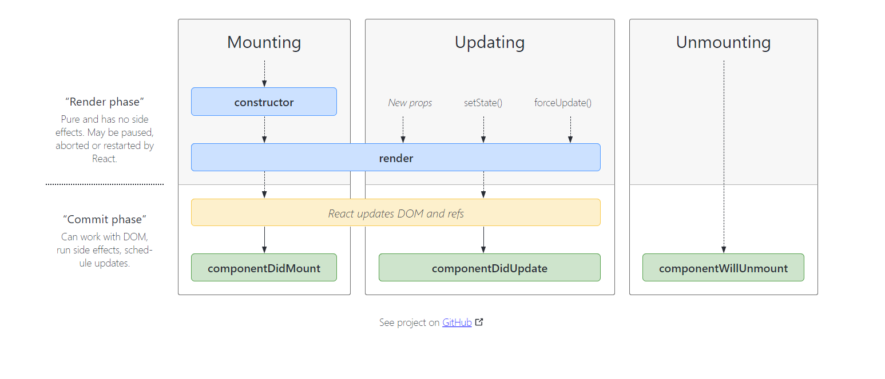

# Episode 8:- Let's get Classy!

- We will study about `Class Based Components`.
- Older way of creating components inside React.
- Latest way is using Functional components.
- Important for Interviews Perspective.
- Understanding of React becomes very strong if you know class based components.
- It will tell about how React Lifecycle works.

We will work on About Component and create it as a Class Component.
First we will create the About section as a functional component and then change it to Class component.

- What is a class based component?
  > It is just a normal JS Class.
  > To create a class based component, we will use this syntax- `class UserClass extends React.component {}`.
  > Inside the class component, which has a render method, that returns a JSX
  > extends React.component & render Method that returns JSX

> What is React.component?

- It is a class given to us by React and userClass is inheriting some properties from it.
- So, we will have to import it from somewhere
- So, we import React into the component

> Sending & Accessing Props inside functional vs Class Components

#### Functional Component

```
- Functional Components prop sending:- <User name={"Aman Relan(Functional Component)"} />
- Functional Components receiving: <h2>Name: {props.name}</h2> where props acts as an argument for the component's arrow function
```

#### Class Component

```
- Class Components prop sending:- <UserClass name={"Aman Relan(Class Component)"} />

- Class Components props receiving:-
In the class, we will create a constructor, and this constructor will now receive the props and we will also assign/ use a keyword - `super(props)`.

- Will be done as :-

constructor(props) {
    super(props);
    console.log(props);
}

- super(props) is very important and has to be written or else it will throw an error.

- Now to use these props from super(props)/ constructor inside the render function, we will use-
this.props.name;

- Whenever the instance of the class is created, a constructor is called and this props is extracted over here as constructor(props){}, and then we can use it as this.props.<whatever is the name of the prop>
```

> What happens if you do not call super(props)?

- React will throw an error as `Uncaught ReferenceError: Must call super constructor in derived class before accessing 'this' or returning from derived constructor`

- In JavaScript, super refers to the parent class constructor. (In our example, it points to the React.Component implementation.)

- Importantly, you can’t use `this` in a constructor until after you’ve called the parent constructor. JavaScript won’t let you

> How to create a state variable inside class components?

- In functional components, we use a hook called, useState.

- In class components, there used to be no hooks. So, we used an old way to create states. So, states were created whenever you created an instance of class.
- Creating an instance of class component means we are loading a class based component on a web page.

- Whenever you create a new instance of a class, the constructor is called.
- This is the best place to receive props & best place to create state variables.
- To create a state variable, we used `this.state`;
- Which is a big object which contains state variable.
- To use state variables, we use it like:- `<h1>Count: {this.state.count}</h1>`

> What if we had to create 2 state component?

- In functional we would just define `const [count2]= useState(1)`;
- but we cannot do so like this in class components
  `this.state = {count:0}, this.state= {count2:1}`

- but this.state is a big object which contains all the variables in a single object. So, we will define so, in class component, as `this.state = { count: 0, count2: 1}`

> How do we update the state variables?

- In functional component, we have a method in definition of state, we used to call the `setCount(<new Count>)` and set the count.

> This way we will do it in the Class Components:-

- We cannot update as `this.state.count = this.state.count + 1`;
- We never update the state variables in class components directly as stated above.
- In Class Component, we can update the state by using an important function provided to us by React.
- The function is `this.setState()`.
- We can use it anywhere inside our class.
- In this function, we will pass an object with the updated value of the state
- Example- `this.setState({ count: this.state.count + 1 });`
- This way react will re render this component and will change the state portion of the html.
- You can even update multiple states together in one `setState` inside class component
- This won't work -> `this.setState({ count: this.state.count + 1 });this.setState({ count2: this.state.count2 + 1 });`
- This will work -> `this.setState({ count: this.state.count + 1 , count2: this.state.count2+1});`

## Lifecycle of Class Based Components

> How react class based components are loaded/mounted on the web page?

- In case of React, we can use the word loaded/mounted interchangably
- Whenever this about component is rendered onto the web page, it starts rendering the JSX.
- Whenever it is rendering, it sees there is another component, first the parent is mounted, and it sees there is other component, so it starts the mounting of the second component.
- When we reach the second component(class component), a new instance of the class is created/instantiated.
- When this class is called/instantiated, it's constructor is called(VERY IMPORTANT).
- Once constructor is called, then it calls render.

> NOTE: You can create a class Component by `class About extends React.Component` or `class About extends Component`(by destructuring `import {Component} from "react"`)

> This above logic becomes a bit complicated if the parent component is also a class based component.So, first parent component is instantiated. So the constructor of this parent is called, then render of this parent is called.Then it goes to the children and it again triggers the lifecycle, then the constructor of this child is called, then render of this child is called.

- Class Based Components also have another important method i.e `componentDidMount()`
- When you define componentDidMount(), it will be called after the render method of the class component is called.
- So, the mounting cycle of the class component:-

1. Renders constructor()
2. Renders render(){}
3. Renders componentDidMount() - when the component has been mounted onto the web page

> Suppose if we had componentDidMount() in the parent class component. What will happen then?

- In this case, it will first load the `constructor()` and then will call the `render()` method, but while it will be rendering it will render and will go to the class based child component. It will see that there is a child, and it will go there but it has not finished rendering yet and then it will trigger the lifecycle methods of the child class components
- So, then the child's `constructor()` will be called, then the child's `render()` method will be called and then the child's `componentDidMount()` will be called and once the children has been mounted successfully, then the parent's `componentDidMount()` will be called.
- So, it is to say that the `componentDidMount()` will be called when the component has been completely Mounted onto the web page.

> Why do we use `componentDidMount()`?

- We use this to make API calls.

> Why is it made inside `componentDidMount()`?

- If we go back for the case of API calling in functional component, we use the `useEffect()` hook to make the API call. What we tried to do there, we first load the component and once the component is loaded is basic details, then we make an API call and fill the details. Why? So react component loads fast. So, Similarly in class based components, we want to render the component as quickly as possible, then make the API call and fill the data.
- So, if we have to make an API call in class based components, we will render the component, then we will make the API call and then fill the data of the API call inside the component(re rendering the component).

> What will happen if there are multiple child components( class based)?

- The order of execution will be

1. Parent Constructor
2. Parent Render
3. Child one constructor
4. Child one render
5. Child two constructor
6. Child two render
7. Child one componentDidMount
8. Child two componentDidMount
9. Parent componentDidMount

This order is because of how the react lifecycle method works


> According to this diagram, the lifecycle works as follows:-

- In react, when component is mounted, it is mounted in 2 phases.

1. Render Phase - first constructor and render is called.
2. Commit Phase- After Render phase, then actually react updates the DOM. Post update of the DOM, then componentDidMount() and that is why this is the best place to make an API call.

And this Mounting cycle happens for every child, every parent, every component in React.

So, our code will work as follows -

- Remember according to the above diagram, there are two phases - (`render phase`) & (`commit phase`).
- About(parent), UserClass(child 1), UserClass(child2)

1. Parent will start the Mounting phase. When Mounting happens, Parent constructor will print
2. Then render will happen in the Mounting phase. So, parent render will print
3. Now, it will see, in the render method that there is a turn for our child 1.
4. It goes to first child and starts lifecycle method of the child
5. Calls the constructor of the first child
6. Calls the render of the first child.
7. Now, as there are two child. React optimises it. So, what will react do? React will not call the `componentDidMount` of the first child but it will batch the render phase of the two child.
8. So, these two childs `Render Phase` will happen. Then `Commit phase` will happen together
9. So, the render phase of child 2 will start.
10. So, the constructor function of the second child will be called and then the render function of the second child will be called.
11. And then it will batch the commit phase of these two child.
12. So, the first child's `componentDidMount` will be called
13. Then, the second child's `componentDidMount` will be called.
14. Post the commit phase of the children, the commit phase will happen for the parent component, so `componentDidMount` of the Parent component will be called.

> Why is react doing this way?

- React does that(batch phase), because once the commit phase starts, react tries to update the DOM. And DOM Manipulation is the most expensive operation when we are updating the component. It(DOM MANIPULATION) takes a lot of time, so it batches the render phase(as it is fast and updates the object created in the VIRTUAL DOM), and once the child components are rendered, then the commit phase happens and the DOM is manipulated.

##### ORDER OF EXECUTION AS PER OUR CODE AND REACT LIFECYCLE METHOD DIAGRAM

- Parent Constructor
- Parent Render

  - First Child Constructor
  - First Child Render

  - Second Child Constructor
  - Second Child Render

  <DOM UPDATE BEGINS- IN Single BATCH>
  - First Child componentDidMount
  - Second Child componentDidMount

- Parent componentDidMount

### How to MAKE an API call, get the Data, put it in to the class based components?

1. We do the API call in `componentDidMount()`
2. To make an async call, we can make the `componentDidMount()` as an async method.
3. Then we can create state variables, inside the class component.
4. And then update the state variable using `this.setState`
5. And then use the state variable for displaying data.

### PROCESS: How did we put the data in the class component?

1. We called the API in `componentDidMount`.
2. We gave default values to the state variables.
3. Then following the react lifecycle method diagram, our constructor was called with the dummy data.
4. Then the render happened, which then updated the DOM with the dummy data
5. Post that, our `componentDidMount` was called.
6. This completed our Mounting phase.
7. Now, the API call was made, it called setState.
8. When we called the setState, updating phase starts.
9. Now setState, updates the state variables
10. When the state variables are updated, React triggers the function render once again.
11. Once again, the render happens but the state variable has been updated with the new value
12. Now in the render cycle, React will update the DOM with the new value
13. Then our data from the API will be updated with our data
14. And according to the react-lifecycle-diagram, it will now call the `componentDidUpdate()` method.

When the update is done, there is also a method `componentDidUpdate()` and it is called at the very end.

```
==> MOUNTING <==
Constructor(dummy)
Render(dummy)
  HTML(dummy)
componentDidMount()
  <API CALL>
  <this.setState> -> State Variable is updated

==> UPDATE <==
  render(API DATA)
  <HTML>(new Element)
  componentDidUpdate()
```

> We also have another lifecycle phase -> Unmounting
> This function is called just before our component is unmounting, which means when this component will disappear from the UI

### NOTE

> Never compare React Lifecycle methods to useEffect

> `componentDidUpdate` is called after every update.

> Why do we have a dependency array in useEffect()?

- `Because there can be multiple state variables where we might want to do checks.`
- `In Class Components, you would do multiple checks maybe using OR operator.`

> Suppose we have to do multiple side effects?

- In functional components, we would have to use 2 useEffects()
- In Class Components, we had to use multiple if/else per state variable

> When will we use `componentWillUnmount()`?

- It is called when we are leaving the component.
- When we go from one component to other component, it is a single page and we are switching components, so we need to clear things up

> What do we need to clear/clean when we switch component?

- Let's say we have a setInterval in some component that does something every second in one component, if we do not clean up and switch components, it will do the functions of setInterval in other components. And if we go back to the original component, without cleaning up, it will start another setInterval and if we go again, it will start another setInterval, so our setIntervals will keep increasing every time we switch to the original component. After a while, this will blow up your app. This will lead into a performance loss. So, every time we have to clearInterval and so to clear this interval, we will do that in `componentWillUnmount()`. We will reference the setInterval by assigning it to a variable in the class component like `this.timer = setInterval(()=> {}, 1000)`. So, cleaning will be like :- `clearInterval(this.timer)`.

- `this` keyword is shared between all the lifecycle methods

> What if we use a `setInterval` inside a useEffect()? How will you clean this up?

- When we use `setInterval` inside useEffect(), the same issue will happen as it was happening in the class component.
- So, how will we destroy the `setInterval in useEffect`?
- We will use `return` inside useEffect. This function is called when you are unmounting the functional component.
- This can be done-

```
useEffect(() => {
  console.log("use Effect");
  const timer = setInterval(() => {}, 1000);

  //Unmounting Phase
  return () => {
    clearInterval(timer);
    console.log("use Effect Return");
  };
}, []);
```
